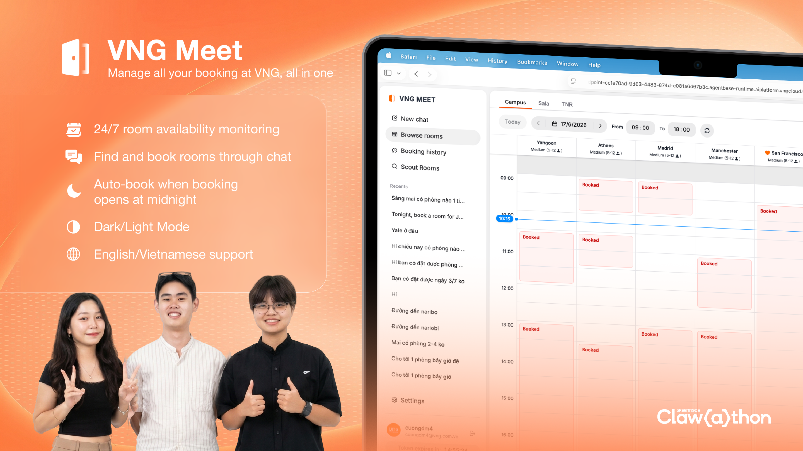

# 🏢 VNGMeet — Vì Starter xứng đáng có phòng họp

VNGMeet là AI agent tích hợp trực tiếp với hệ thống đặt phòng nội bộ của VNG — giúp Starter tìm, book, và quản lý phòng họp một cách thông minh, không cần mò phòng từng giờ; không cần thức khuya canh phòng, mà vẫn có phòng họp phù hợp cho cả team.

---

## 😩 PROBLEM

Gọi phòng họp ở VNG là vàng vì ngày nào Starter cũng đào mãi mà không ra.

**😤 Không tìm được phòng trống nhanh chóng.** Trên Outlook không có view tổng quan — muốn biết khung giờ nào còn phòng, Starter phải tự mò vào từng slot một như đi đào vàng. Ăn may thì có phòng, không thì thôi. Kết quả là mất 10–15 phút chỉ để biết "hết phòng rồi."

**🌙 Phải thức đêm để canh slot mở.** Phòng họp chỉ được đặt trước tối đa 14 ngày. Với các lịch họp cố định, Starter buộc phải ngồi canh đúng 12 giờ đêm — thời điểm slot mới mở ra — để book phòng trước người khác. Không phải săn sale, nhưng cảm giác y chang.

**🎰 Có phòng trống nhưng không ai biết.** Trong ngày, phòng họp bị hủy hoặc trả lại liên tục — nhưng không có cơ chế thông báo. Starter muốn tận dụng slot vừa trống phải tự vào check tay như chơi xổ số. Cơ hội đến rồi đi trong khi Starter đang bận làm việc khác.

Phòng họp chỉ là nơi để ngồi họp. Nhưng việc tìm được nó đang tốn thời gian của Starter nhiều hơn cả việc chuẩn bị nội dung buổi họp đó.

---

## 👤 USER

| Who | How to Use |
|---|---|
| **Starters** — Nhân viên bất kể cấp bậc | Người trực tiếp book phòng họp hàng ngày — tìm slot, xác nhận phòng, gửi invite cho cả team. Dùng VNGMeet để tìm và book nhanh qua một lệnh chat (Book qua chat) hoặc một lượt scan (Book qua Browse Room). |
| **Team Leads & Quản lý** | Người có lịch họp cố định — thường cần book phòng xa trước hoặc tìm phòng bất chợt. Dùng VNGMeet để tự động book phòng ngay khi slot mở lúc nửa đêm (Scheduled booking), hoặc tự động chớp phòng trống ngay khi có (Room Scouting). |

---

## 💡 SOLUTION

VNGMeet là AI agent tích hợp trực tiếp với hệ thống đặt phòng nội bộ VNG. Starter không cần nhớ tên phòng, không cần lên Outlook mò — chỉ cần nói nhu cầu.

### ✅ Use case 1 — "Đào" phòng

Thay vì mò vào hệ thống tìm từng slot, Starter chỉ cần nhắn nhu cầu và VNGMeet trả về phòng phù hợp ngay lập tức — bao gồm cả gợi ý slot lân cận nếu khung giờ mong muốn đã kín. Ai lười chat thì có thể dùng chế độ browse để xem toàn bộ phòng trống trực quan và book luôn.

**User flow:**

1. Starter nhập vào khung chat khung giờ họp, số người
2. VNGMeet search real-time → trả về list phòng trống phù hợp
3. Nếu không có → VNGMeet gợi ý slot lân cận có phòng trống
4. Starter chọn phòng → VNGMeet book và gửi confirm qua Outlook
5. Starter cần chỉnh sửa hoặc hủy phòng họp → Starter chat trực tiếp với VNGMeet

**Ví dụ hội thoại:**

> **Starter:** Mình cần 1 phòng họp lúc 9h sáng mai cho 4 người
>
> **VNGMeet:** Khung giờ trên hiện tại đã hết phòng trống phù hợp. Tuy nhiên, mình thấy khung 10:00 sáng mai còn 2 phòng phù hợp cho bạn:
> - 📍 Phòng Amsterdam – V2 – F3 – 4 Seats
> - 📍 Phòng Beijing – V1 – F1 – 8 Seats
>
> Bạn muốn book phòng nào?
>
> **Starter:** Amsterdam
>
> **VNGMeet:** Mình đã book Phòng Amsterdam – V2 – F3 – 4 Seats lúc 10:00–11:00 ngày mai. Bạn có thể check lại Outlook để nhận confirm nhé!

---

### ✅ Use case 2 — "Đặt gạch" phòng

Với những lịch họp cố định cần book phòng đúng ngày slot book phòng mở, VNGMeet cho phép Starter đăng ký trước ý định — rồi tự động book phòng đúng thời điểm lịch book mở mà không cần ai thức canh. Starter không cần thức khuya để có phòng đẹp nữa.

**User flow:**

1. Starter nhập vào khung chat tên phòng + khung giờ mong muốn trong tương lai
2. VNGMeet lưu yêu cầu và theo dõi thời điểm slot mở
3. Đúng lúc hệ thống mở đăng ký → VNGMeet tự động book
4. Starter nhận confirm qua Outlook — không cần thức khuya canh

**Ví dụ hội thoại:**

> **Starter:** Tôi muốn book phòng Amsterdam lúc 9:00 sáng ngày 01/07.
>
> **VNGMeet:** Phòng này hiện chưa cho phép Starter book. Mình sẽ book phòng Amsterdam, 9:00 sáng ngày 01/07 ngay khi phòng này mở cho Starter book nhé!
>
> *(Ngày 17/06, 00:01)*
>
> **VNGMeet:** Mình đã book thành công Phòng Amsterdam, 9:00 sáng ngày 01/07. Bạn có thể check lại Outlook để nhận confirm nhé!

---

### ✅ Use case 3 — "Trinh sát" phòng

Đôi khi phòng họp bị hủy giữa chừng và trả lại — nhưng người thật sự cần thì không biết. VNGMeet giải quyết bằng cách chủ động rà soát mỗi phút và **tự động đặt luôn** phòng phù hợp đầu tiên xuất hiện trong ngày, không cần Starter thao tác thêm.

**User flow:**

1. Starter nhập vào tab "Scout Rooms" khung giờ muốn có phòng, thời lượng họp, số người
2. VNGMeet tự động check hệ thống mỗi phút
3. VNGMeet phát hiện phòng thoả mãn → đặt luôn khối giờ trống sớm nhất trong khung
4. Meeting xuất hiện trên lịch Starter, confirm về Outlook — không cần book thủ công

**Ví dụ thao tác:**

> **Starter** điền các nội dung tương ứng:
> - Office: Campus
> - Duration: 1 hour
> - Scout Range: 14:00 – 18:00
> - Capacity: 4 people
>
> **VNGMeet:** Đã bật chế độ tìm phòng trống. Tôi sẽ check mỗi phút và tự động đặt ngay khi có phòng trống phù hợp.
>
> *(2 tiếng sau — meeting tự lên lịch, confirm về Outlook)*
>
> **VNGMeet:** ✅ Đã đặt phòng trống phù hợp: Phòng Amsterdam – V2 – F3 – 4 Seats, lúc 14:00 – 15:00 hôm nay. Check Outlook để nhận confirm nhé!

---

### ✅ Add-in Function — "Soi" phòng

Starter vào tab Browse để thấy toàn bộ availability của tất cả phòng họp theo dạng calendar, filter theo vị trí, ngày, hoặc khung giờ, và book luôn tại chỗ mà không cần chat.

**User flow:**

1. Starter vào tab "Browse"
2. VNGMeet hiển thị toàn bộ phòng và availability theo dạng calendar
3. Starter filter theo vị trí / ngày / khung giờ nếu cần
4. Starter thấy phòng phù hợp → click book luôn, không cần quay lại chat

**Ví dụ thao tác:**

> Starter mở tab "Browse Rooms", filter vị trí "Campus", thời gian "Thứ 4, 17/06/2026" → Starter thấy ngay Phòng Amsterdam trống 2h–4h chiều trong khi các phòng khác đã kín. Starter click book luôn, và nhận confirm qua Outlook. Starter không cần nhắn một chữ nào.

---

### ✅ More Convenience

- **Map nội bộ** — Tích hợp map chỉ đường đến bất kỳ phòng họp nào
- **Phòng yêu thích** — Lưu vị trí ngồi làm việc để được ưu tiên gợi ý những phòng gần mình nhất. Lưu các phòng hay dùng để book nhanh hơn lần sau
- **Giao diện song ngữ** — Tiếng Việt / English, tự động theo ngôn ngữ Starter nhắn
- **Dark / Light mode** — Muốn mình trông dễ thương hay quyến rũ?

---

## 🎯 VALUES

- 🔍 **Tìm được phòng họp:** Không còn tìm phòng phút chót, họp muộn, hủy họp, hay.... họp đứng.
- 😴 **Ngủ ngon vẫn có phòng:** Đặt phòng trước bất cứ lúc nào, tới đúng ngày giờ là có phòng để họp mà không cần thức khuya canh phòng
- 🔔 **Canh phòng trống tự động:** Có phòng vừa trống là biết ngay, không cần ngồi canh mà vẫn làm được việc khác
- 📅 **Nhìn toàn bộ phòng trên Calendar:** Thấy ngay toàn cảnh phòng trống một lượt — không cần mò từng slot như lật bài
- 🗺️ **Đến đúng phòng, đúng giờ:** 1 câu lệnh duy nhất để có map tới bất cứ phòng họp nào

---

## 🔧 TECHNICAL NOTE

Do giới hạn thời gian, hệ thống hiện tại xác thực người dùng bằng **Microsoft Graph access token** dán thủ công, thay vì luồng OAuth đầy đủ qua Azure AD.

**Lưu ý quan trọng:** Token có hiệu lực tối đa **24 giờ**. Khi hết hạn, các tính năng sẽ ngừng hoạt động và người dùng cần đăng nhập lại bằng cách cung cấp token mới.

**Bảo mật:** Token được mã hoá bằng **Fernet (AES-128-CBC)** trước khi lưu vào hệ thống, và chỉ được sử dụng cho các mục đích sau:

| Permission | Mục đích |
|---|---|
| `Place.Read.All` | Liệt kê danh sách phòng họp trong tổ chức |
| `Calendars.Read.Shared` | Đọc trạng thái trống/bận của phòng (free-busy) |
| `Calendars.ReadWrite` | Đặt phòng, chỉnh sửa, huỷ meeting trên lịch người dùng |
| `Mail.Send` | Gửi email thông báo (dự phòng; Room Scout hiện tự động đặt phòng nên không dùng) |
| `User.Read` | Đọc thông tin cơ bản của người dùng đang đăng nhập |

---

## 🙌 CREDIT

Dự án được phát triển bởi team **Texas Chicken** gồm 3 starter: CuongDM4, HuyenNN, AnhDT11

- Auth: Microsoft Access Token
- Server: GreenNode AgentBase
- Model: MiniMax M2.5
- Library UI: Hero UI
- Icon: Gravity Icon
- Image/thumbnail: My VNG & Fanpage VNG
- Inspired by: HoanDN
