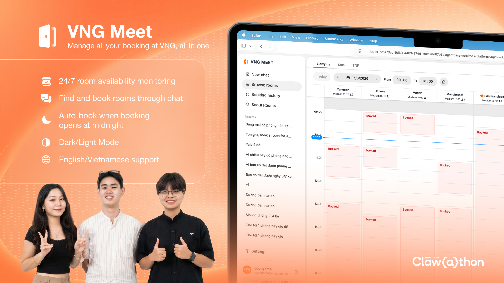

# VNGMeet

VNGMeet là AI agent tích hợp với hệ thống đặt phòng họp Microsoft 365 của VNG, hỗ trợ nhân viên (Starter) tìm, đặt và quản lý phòng họp bằng ngôn ngữ tự nhiên.

**Team:** Texas Chicken (CuongDM4, HuyenNN, AnhDT11)
**Truy cập:** https://vng-meet.ai.zalopay.xyz
**Mã nguồn:** https://github.com/mxnhcxxng/VNGMeet

---

## 1. Mục đích

Đặt phòng họp qua Outlook hiện gặp ba vấn đề:

- **Không có cái nhìn tổng quan về phòng trống.** Outlook không có view tổng hợp; người dùng phải kiểm tra từng phòng, từng khung giờ, thường mất 10–15 phút chỉ để biết khung giờ cần đã hết phòng.
- **Phải canh giờ mở lịch.** Phòng chỉ đặt được trước tối đa 14 ngày. Với lịch họp cố định, người dùng phải canh đúng 0:00 - thời điểm lịch mới mở - để giữ phòng.
- **Không biết khi phòng được trả lại.** Phòng bị huỷ hoặc trả lại trong ngày không được thông báo; người đang cần phòng phải tự kiểm tra thủ công.

VNGMeet giải quyết các vấn đề trên: người dùng chỉ cần nêu nhu cầu, agent tra cứu phòng trống theo thời gian thực, đặt phòng, tự động đặt trước khi lịch mở, và tự động giữ phòng khi có phòng được trả lại.

## 2. Đối tượng sử dụng

| Nhóm | Nhu cầu chính |
|---|---|
| Nhân viên (mọi cấp bậc) | Tìm và đặt phòng hằng ngày, xem/đổi/huỷ lịch đã đặt, tìm đường đến phòng. Sử dụng qua chat hoặc tab Browse Rooms. |
| Team Lead, Quản lý | Đặt trước phòng cho lịch họp cố định (Scheduled booking); tự động giữ phòng khi có phòng trống trong khung giờ cần (Room Scout). |

## 3. Chức năng

| Chức năng | Hỗ trợ qua chatbot |
|---|---|
| Tìm và đặt phòng | ✅ |
| Đặt trước (Scheduled booking) | ✅ |
| Săn phòng (Room Scout) | ✅ Bật và dừng săn phòng; theo dõi trạng thái tại tab **Scout Rooms** |
| Quản lý lịch | ✅ |
| Chỉ đường | ✅ |
| Xem phòng (Browse Rooms) | ❌ Chỉ trên tab **Browse Rooms** |
| Phòng yêu thích, vị trí chỗ ngồi | ❌ Chỉ cài đặt trên giao diện app |

Ngoài ra: giao diện song ngữ Tiếng Việt / English (agent trả lời theo ngôn ngữ người dùng nhắn), hỗ trợ Dark / Light mode.

### 3.1. Tìm và đặt phòng

1. Người dùng mô tả nhu cầu bằng ngôn ngữ tự nhiên: ngày, khung giờ hoặc thời lượng, quy mô phòng.
2. Agent tra cứu real-time và trả về danh sách phòng trống phù hợp.
3. Nếu khung giờ yêu cầu đã kín, agent gợi ý khung giờ lân cận còn phòng.
4. Người dùng chọn phòng → agent tạo phiếu xác nhận → người dùng bấm **Đồng ý** → cuộc họp được tạo trên Outlook. Phòng chỉ được đặt sau khi người dùng xác nhận.
5. Khi cần đổi giờ hoặc huỷ, người dùng yêu cầu trực tiếp qua chat.

> **Người dùng:** Mình cần 1 phòng họp lúc 9h sáng mai cho 4 người
>
> **VNGMeet:** Khung giờ trên hiện đã hết phòng phù hợp. Khung 10:00 sáng mai còn 2 phòng:
> - Phòng Amsterdam – V2 – F3
> - Phòng Beijing – V1 – F1
>
> Bạn muốn đặt phòng nào?
>
> **Người dùng:** Amsterdam
>
> **VNGMeet:** Đã tạo phiếu xác nhận phòng Amsterdam, 10:00–11:00 ngày mai. Bạn bấm Đồng ý trên thẻ để xác nhận nhé.

### 3.2. Đặt trước (Scheduled booking)

1. Người dùng nhập tên phòng và khung giờ trong tương lai, tại ngày chưa mở lịch đặt.
2. Agent lưu yêu cầu và theo dõi thời điểm lịch mở.
3. Đúng thời điểm lịch mở, agent tự động đặt phòng.
4. Người dùng nhận xác nhận qua Outlook.

> **Người dùng:** Tôi muốn đặt phòng Amsterdam lúc 9:00 sáng ngày 01/07.
>
> **VNGMeet:** Phòng này hiện chưa mở lịch đặt. Mình sẽ tự động đặt phòng Amsterdam, 9:00 sáng ngày 01/07 ngay khi lịch mở.
>
> *(Ngày 17/06, 00:01)*
>
> **VNGMeet:** Đã đặt thành công phòng Amsterdam, 9:00 sáng ngày 01/07. Bạn kiểm tra Outlook để nhận xác nhận.

### 3.3. Săn phòng (Room Scout)

1. Người dùng nhập khung giờ cần phòng, thời lượng họp và quy mô phòng (qua chat hoặc tab **Scout Rooms**).
2. Agent kiểm tra hệ thống mỗi phút.
3. Khi phát hiện phòng thoả điều kiện, agent tự động đặt khối giờ trống sớm nhất trong khung.
4. Cuộc họp xuất hiện trên lịch người dùng, xác nhận gửi về Outlook.

> Người dùng điền: Office: Campus · Duration: 1 hour · Scout Range: 14:00–18:00 · Capacity: 4 people
>
> **VNGMeet:** Đã bật săn phòng. Hệ thống sẽ kiểm tra mỗi phút và tự động đặt khi có phòng phù hợp.
>
> *(2 giờ sau)*
>
> **VNGMeet:** Đã đặt phòng Amsterdam – V2 – F3, 14:00–15:00 hôm nay. Bạn kiểm tra Outlook để nhận xác nhận.

### 3.4. Quản lý lịch

Người dùng xem, đổi giờ hoặc huỷ các cuộc họp đã đặt qua chat. Agent chỉ hiển thị lịch của chính người dùng; thao tác huỷ luôn yêu cầu xác nhận.

### 3.5. Chỉ đường

Agent trả vị trí phòng (toà, tầng, khu vực), hướng dẫn đường đi và bản đồ đến phòng họp.

### 3.6. Xem phòng (Browse Rooms)

1. Người dùng mở tab **Browse Rooms**.
2. Hệ thống hiển thị toàn bộ phòng và trạng thái trống/bận dạng calendar.
3. Người dùng lọc theo vị trí, ngày hoặc khung giờ.
4. Người dùng chọn phòng phù hợp và đặt trực tiếp, không cần chat.

### 3.7. Phòng yêu thích, vị trí chỗ ngồi

Người dùng lưu các phòng hay dùng để đặt nhanh, và lưu vị trí chỗ ngồi để được ưu tiên gợi ý phòng gần.

## 4. Phạm vi dữ liệu

**Nguồn dữ liệu.** Agent chỉ làm việc với Microsoft 365 (qua Microsoft Graph) trong quyền của chính người dùng đăng nhập, cùng dữ liệu vị trí/bản đồ phòng do team tự xây dựng.

| Quyền Microsoft Graph | Mục đích |
|---|---|
| `Place.Read.All` | Liệt kê danh sách phòng họp |
| `Calendars.Read.Shared` | Đọc trạng thái trống/bận của phòng (không đọc nội dung cuộc họp) |
| `Calendars.ReadWrite` | Đặt, đổi, huỷ cuộc họp trên lịch của chính người dùng |
| `Mail.Send` | Gửi email thông báo (dự phòng; Room Scout hiện tự động đặt phòng nên không sử dụng) |
| `User.Read` | Đọc thông tin cơ bản của người dùng đăng nhập |

**Giới hạn truy cập.**
- Agent luôn hành động thay cho đúng người dùng của phiên hiện tại; danh tính do hệ thống xác định, không lấy từ nội dung chat.
- Không đọc, không tiết lộ lịch hay dữ liệu của người dùng khác. Với phòng họp, agent chỉ biết trạng thái trống/bận.
- Chỉ trả lời trong phạm vi đặt phòng và lịch họp; các yêu cầu khác bị từ chối.

**Lưu trữ và bảo mật.**
- Access token Microsoft được mã hoá (Fernet, AES-128-CBC) trước khi lưu, có hiệu lực tối đa 24 giờ.
- Hệ thống lưu: bộ đệm trạng thái trống/bận của phòng (14 ngày tới), hồ sơ cơ bản, phòng yêu thích, yêu cầu đặt trước/săn phòng của người dùng.

## 5. Cách dùng

1. Truy cập https://vng-meet.ai.zalopay.xyz và đăng nhập theo một trong hai cách:
   - Đăng nhập trực tiếp bằng tài khoản Microsoft công ty.
   - Dán Microsoft Graph access token.
2. Mở tab **Chat** và nhập yêu cầu, ví dụ:
   - `Chiều nay có phòng nào 1 tiếng không?`
   - `Đặt phòng Madrid 16h-17h hôm nay`
   - `Chiều nay tôi có lịch nào không?` → `Huỷ giúp tôi`
   - `Chỉ đường đến phòng Madrid`
3. Kiểm tra phiếu xác nhận và bấm **Đồng ý** để đặt. Cuộc họp xuất hiện trên Outlook ngay sau đó.
4. Các tab khác:
   - **Browse Rooms** - xem toàn bộ phòng trống dạng calendar và đặt trực tiếp.
   - **Scout Rooms** - bật săn phòng: chọn ngày, khung giờ, thời lượng, quy mô phòng.

**Giới hạn hiện tại:**
- Chỉ đặt được phòng trong vòng 15 ngày kể từ hôm nay; khung giờ làm việc 09:00–18:00.
- Với cách đăng nhập bằng Microsoft Graph access token, token có hiệu lực tối đa 24 giờ; khi hết hạn, người dùng cần đăng nhập lại.

## 6. Giá trị mang lại

- **Tìm được phòng nhanh:** giảm tình trạng tìm phòng phút chót, họp muộn hoặc phải huỷ họp vì không có phòng.
- **Không cần canh giờ mở lịch:** đăng ký trước, agent tự đặt đúng thời điểm.
- **Tận dụng phòng được trả lại:** phòng vừa trống được tự động giữ cho người cần.
- **Tổng quan toàn bộ phòng:** xem trạng thái tất cả phòng trên một calendar thay vì kiểm tra từng slot.
- **Đến đúng phòng:** một câu lệnh để có chỉ đường và bản đồ đến bất kỳ phòng họp nào.

## 7. Công nghệ và ghi nhận

| Hạng mục | Sử dụng |
|---|---|
| Xác thực | Đăng nhập Microsoft, Microsoft Graph access token |
| Hạ tầng | ZaloPay Agent Base |
| Mô hình ngôn ngữ | MiniMax M2.5 (qua GreenNode AgentBase) |
| Backend | FastAPI, Supabase |
| Frontend | Next.js, Hero UI |
| Icon | Gravity Icon |
| Hình ảnh / thumbnail | My VNG & Fanpage VNG |

Ý tưởng lấy cảm hứng từ HoanDN.
